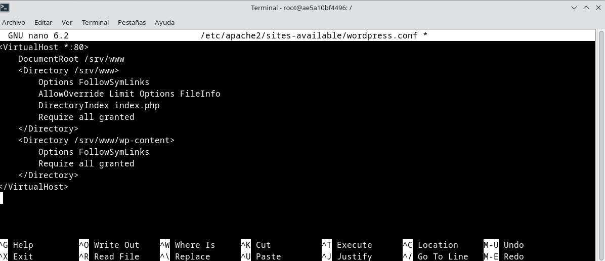
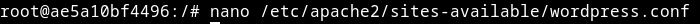

# Tarea04

## Índice

1. [**Instalar LAMP**](#instalar-lamp)
2. [**Descargar WordPress**](#descargar-wordpress)
3. [**Configurar Apache para WordPress**](#configurar-apache-para-wordpress)
4. [**Configurar Base de Datos**](#configurar-base-de-datos)
5. [**Conectar WordPress a la Base de Datos**](#conectar-wordpress-a-la-base-de-datos)
6. [**Configurar WordPress**](#configurar-wordpress)

## Utiliza la imagen de Ubuntu , tag 22 y apoyandote en esta guía sigue sus instrucciones para instalar LAMP en dicho contenedor. 

**Descargamos la imagen de Ubuntu 22**


**Ejecutamos el contenedor con el siguiente comando:**

```
sudo docker run -d -it --name ubuntu-lamp ubuntu:22.04
```
**Entramos en la terminal del contenedor**


**Para instalar LAMP en el contenedor, primero actualizamos el sistema con el siguiente comando:**

```
 apt update
```
**Instalamos Apache2 con el siguiente comando:**

```
 apt install -y apache2 apache2-utils
```
**Instalamos MariaDB con el siguiente comando:**

```
 apt install -y mariadb-server mariadb-client
```
**Completamos la instalación de MariaDB  después de ejecutarla con el siguiente comando:**

```
 mysql_secure_installation
```
**Por último instalamos PHP con el siguiente comando:**

```
 apt install -y php php-mysql libapache2-mod-php
```
**Reiniciamos el servicio de Apache2 con el siguiente comando:**

```
 systemctl restart apache2
```

**Retomamos el ejercicio donde lo habiamos dejado el otro día. No tenemos ningun contenedor funcionando (podemos comprobarlo con este comando)**


**Para volver a inicarlo usamos el id del contenedor que buscamos con el comando**


**Apuntamos el ID del contenedor que queremos volver a ejecutar y ejecutamos este comando**


## Descargar WORDPRESS

**Para descargarlo vamos a seguir la guía de Ubuntu:** 

https://ubuntu.com/tutorials/install-and-configure-wordpress#1-overview

**Primero tenemos que instalar las dependencias necesarias con este comando pegado de la guia**
```
sudo apt update
sudo apt install apache2 \
                 ghostscript \
                 libapache2-mod-php \
                 mysql-server \
                 php \
                 php-bcmath \
                 php-curl \
                 php-imagick \
                 php-intl \
                 php-json \
                 php-mbstring \
                 php-mysql \
                 php-xml \
                 php-zip```
```

**Para el siguiente paso necesitamos curl, por eso vamos a instalarlo (si lo tienes ya instalado no hace falta):**


```
 mkdir -p /srv/www
 chown www-data: /srv/www
```

 **Descargamos la última versión de wordpress:**

 

**Extraemos el archivo .gz**
```

 tar zxvf latest.tar.gz -C /srv/www --strip-components=1
```
**Asignamos permisos**

```
 chown -R www-data:www-data /srv/www
```

**Para comprobar podemos ejecutar este comando:**


## Configurar Apache para WordPress

**Primero instalamos nano para poder editar archivos de texto**

```
apt update
apt install nano

```

**Usamos el comando para crear el archivo**
```
nano /etc/apache2/sites-available/wordpress.conf
```
**Copiamos el texto dentro del archivo de configuración de wordpres**



**Habilitamos la nueva configuración:** 

```
a2ensite wordpress
```

**Al ejecutar este comando nos da este error**


**Para que Apache2 funcione lo inicamos con este comando**

```
service apache2 start
```


**Ahora ya podemos ejecutar el comando que nos daba error**


**Ahora inicializamos la URL**


**Desconectamos el "ITWORKS" site con el siguiente comando**


**Volvemos a abrir el archivo de config de nano con wordpress.conf**



**Añadimos en ese archivo lo especificado en la guía** 
```
   ServerName hostname.example.com
```
**Lo modificamos en el archivo:**


**Por último para cargar los cambios recargarmos apache con este comando**
```
service apache2 reload
```
## Configurar Database
```
mysql -u root
```


**Configuramos la base de datos wordpress:**


## Conectamos wordpress a la base de datos que acabamos de crear

**Modificamos el nombre de la base de datos, el usuario y la contrasñea por las que creamos al crear la base de datos en MARIADB**


*Cambiamos base de datos por wordpress
El usuario por wordpress@localhost
Y contraseña por "amante5"*

**Borramos las frases que nos pide la guía**


**Lo cambiamos por las frases del archivo referido en la guía**


## Configurar WORDPRESS

**Entramos en un buscador y colocamos nuestra ip para poder entrar en wordpress**

```
http://10.0.2.15:8000/wp_admin/install.php?language=en_US
```

**Se nos abrirá la interfaz de wordpress en el navegador y rellenamos nuestros datos conforme ya los habíamos puesto en la configuración del docker.**


**Rellenamos nuestros datos elegidos y finalmente estamos dentro de WORDPRESS!!**


